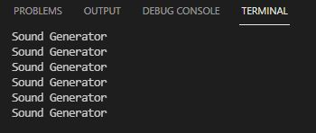

# PRÁCTICA 6: Buses de comunicación II (SPI)
## Práctica 6A: LECTURA/ESCRITURA DE MEMORIA SD
### Código:
```
#include <Arduino.h>
#include <SPI.h>
#include <SD.h>

File myFile;

void setup()
{
    Serial.begin(115200);
    Serial.print("Iniciando SD ...");
    SPI.begin(18,19,23,5);

    if (!SD.begin(5)) {
        Serial.println("No se pudo inicializar");
        return;
    }
    Serial.println("inicializacion exitosa");
    
    if(!SD.exists("/archivo.txt")){
            Serial.println("example.txt exists.");
    }

    else{
            Serial.println("example.txt no exists.");
    }

    myFile = SD.open("/archivo.txt", FILE_WRITE);
    myFile.close();

    if (SD.exists("/archivo.txt")){


            Serial.println("archivo.txt exists. ");
    }
    else{
            Serial.println("archivo.txt doesn't exist");
    }
    myFile = SD.open("/archivo.txt", FILE_WRITE);//abrimos  el archivo 
    myFile.println("Hola mundo");
    myFile.close();
    myFile=SD.open("/archivo.txt");
    if (myFile) {
        Serial.println("archivo.txt:");
        while (myFile.available()) {
            Serial.write(myFile.read());
        }
        myFile.close(); //cerramos el archivo
    } else {
        Serial.println("Error al abrir el archivo");
    }
}

void loop()
{}
```

### Descibir la salida por el puerto serie:
Compilamos y subimos el programa a la placa. Este progrma al subirlo hace que en la tarjeta SD incorporada en el lector de tarjetas se cree un archivo con un contenido dentro. Después de crear el archivo el código hace que se abra  mostrando al monitorear el programa el contenido por pantalla, en este caso "Hola mundo".


### Explicar el funcionamiento:
Para poder ejecutar el programa utilixando el lector de tarjetas SD, primeramente hay que declarar las siguientes librerias:
```
#include <Arduino.h>
#include <SPI.h>
#include <SD.h>
```

Declaramos también la variable:
```
File myFile;
```

Ya dentro del setup empezamos a iniciando la comunicación serial, enviando un mensaje conforme iniciamos la tarjeta y declarand los pins VSPI:
```
Serial.begin(115200);
Serial.print("Iniciando SD ...");
SPI.begin(18,19,23,5);
```

Seguidamente iniciamos la tarjeta, en el caso que no se pueda inicializar nos mostrara por pantalla un mensaje conforme no se ha podido inicializar, y lo mismo si finalmente se ha iniciado éxito.
```
if (!SD.begin(5)) {
        Serial.println("No se pudo inicializar");
        return;
    }
Serial.println("inicializacion exitosa");
```

Con esta pequeña condición comprovamos si en la tarjeta hay algun archivo de texto dentro y nos muestar por panatalla un mensaje diferente dependiendo de lo que encuentre:
```
if(!SD.exists("/archivo.txt")){
            Serial.println("example.txt exists.");
    }

    else{
            Serial.println("example.txt no exists.");
    }

```

A continuación generamos un nuevo archivo:
```
myFile = SD.open("/archivo.txt", FILE_WRITE);
myFile.close();
```

Hacemos una nuevo condición para comprovar si se ha generado el fichero:
```
if (SD.exists("/archivo.txt")){
    Serial.println("archivo.txt exists. ");
}
else{
    Serial.println("archivo.txt doesn't exist.");
}
```

Abrimos el fichero y escribimos en el fichero:
```
myFile = SD.open("/archivo.txt", FILE_WRITE);//abrimos  el archivo 
myFile.println("Hola mundo");
myFile.close();
```

Finalmente, abrimos el documento y hacemos una condición donde en el caso de que cumpla que el documento este abierto nos mostrara por pantalla lo que haya escrito dentro de el documento y luego lo cerrara. Por otro lado si este archivo no se ha podido abrir nos mostrara por pantalla un mensaje informandonos de que no se ha podido abrir el documento:
```
myFile=SD.open("/archivo.txt");
if (myFile) {
    Serial.println("archivo.txt:");
    while (myFile.available()) {
        Serial.write(myFile.read());
    }
    myFile.close(); //cerramos el archivo
} else {
    Serial.println("Error al abrir el archivo");
}
```


## Práctica 6B: LECTURA DE ETIQUETA RFID
### Código:
```
#include <SPI.h>
#include <MFRC522.h>

#define RST_PIN	21    //Pin 9 para el reset del RC522
#define SS_PIN	15   //Pin 10 para el SS (SDA) del RC522
MFRC522 mfrc522(SS_PIN, RST_PIN); //Creamos el objeto para el RC522

void setup() {
	Serial.begin(115200); //Iniciamos la comunicación  serial
	SPI.begin(14,12,13,15);        //Iniciamos el Bus SPI
	mfrc522.PCD_Init(); // Iniciamos  el MFRC522
	Serial.println("Lectura del UID");
}

void loop() {
	// Revisamos si hay nuevas tarjetas  presentes
	if ( mfrc522.PICC_IsNewCardPresent()) 
        {  
  		//Seleccionamos una tarjeta
            if ( mfrc522.PICC_ReadCardSerial()) 
            {
                  // Enviamos serialemente su UID
                  Serial.print("Card UID:");
                  for (byte i = 0; i < mfrc522.uid.size; i++) {
                          Serial.print(mfrc522.uid.uidByte[i] < 0x10 ? " 0" : " ");
                          Serial.print(mfrc522.uid.uidByte[i], HEX);   
                  } 
                  Serial.println();
                  // Terminamos la lectura de la tarjeta  actual
                  mfrc522.PICC_HaltA();         
            }      
	}	
}

```

### Descibir la salida por el puerto serie:
Compilamos y subimos el programa a la placa. Este programa hace que al pasar una tarjeta o unn llavero por delante del sensor que estamos utilizando, monitorizando el programos podamos ver un display en la pantalla del ordenador donde vamos a ver el código de la tarjeta o llavero que estemos pasando por el sensor.


### Explicar el funcionamiento:
Para poder utilizar este sensor primeramente hemos de instalar una libreria llamada "MFRC522" y declararla:
```
#include <SPI.h>
#include <MFRC522.h>
```

Seguidamente definimos los pines para los pines de reset y SDA. También creamos el objeto para estos:
```
#define RST_PIN	21    //Reset
#define SS_PIN	15   //(SDA)
MFRC522 mfrc522(SS_PIN, RST_PIN); //Creamos el objeto para el RC522
```

En el setup primeramente inicializamos la comunicación serial, seguidamente inicializamos el bus SPI y el MFRC522. Finalmente imprimimos por pantalla un mensaje que se mostrara cuando podamos empezar ha pasar la tarjeta o e llavero por el sensor.
```
void setup() {
	Serial.begin(115200); //Iniciamos la comunicación  serial
	SPI.begin(14,12,13,15);        //Iniciamos el Bus SPI
	mfrc522.PCD_Init(); // Iniciamos  el MFRC522
	Serial.println("Lectura del UID");
}
```

Ya en el loop empezamos a trabajar con lo que vamos pasando por el sensor. En primer lugar el sensor va ir revisando si pasamos alguna cosa por delante, seguidamente selecciona la tarjeta que le hemos mostrado, de la cual por pantalla nos va a mostrar su UID. Y finalmente terminamos con la lectura de la tarjeta actual.
```
void loop() {
	// Revisamos si hay nuevas tarjetas  presentes
	if ( mfrc522.PICC_IsNewCardPresent()) 
        {  
  		//Seleccionamos una tarjeta
            if ( mfrc522.PICC_ReadCardSerial()) 
            {
                  // Enviamos serialemente su UID
                  Serial.print("Card UID:");
                  for (byte i = 0; i < mfrc522.uid.size; i++) {
                          Serial.print(mfrc522.uid.uidByte[i] < 0x10 ? " 0" : " ");
                          Serial.print(mfrc522.uid.uidByte[i], HEX);   
                  } 
                  Serial.println();
                  // Terminamos la lectura de la tarjeta  actual
                  mfrc522.PICC_HaltA();         
            }      
	}	
}
```


## Práctica 6C:
### Montaje:


### Salidas de depuración:
Compilamos y ejecutamos el programa. Al monitorearlo, podemos observar que muestra por pantalla la frase "Sound generator". Teniendo a mano un altavoz y connectandolo podemos ecuhar a un señor hablando.



### Código generado:
```
#include "Arduino.h"
#include "FS.h"
#include "HTTPClient.h"
#include "SPIFFS.h"
#include "SD.h"
#include "SPI.h"
#include "AudioGeneratorAAC.h"
#include "AudioOutputI2S.h"
#include "AudioFileSourcePROGMEM.h"
#include "sampleaac.h"

AudioFileSourcePROGMEM *in;
AudioGeneratorAAC *aac;
AudioOutputI2S *out;

void setup(){
  Serial.begin(115200);
  in = new AudioFileSourcePROGMEM(sampleaac, sizeof(sampleaac));
  aac = new AudioGeneratorAAC();
  out = new AudioOutputI2S();
  out -> SetGain(0.125);
  out -> SetPinout(26,25,22);
  aac->begin(in, out);
}

void loop(){
  if (aac->isRunning()) {
    aac->loop();
    } else {

      aac -> stop();
      Serial.printf("Sound Generator\n");
      delay(1000);
  }
}
```

### Explicación del código:
Declaramos las librerias necesarias para el amplificador "ESP8266Audio":
```
#include "Arduino.h"
#include "FS.h"
#include "HTTPClient.h"
#include "SPIFFS.h"
#include "SD.h"
#include "SPI.h"
#include "AudioGeneratorAAC.h"
#include "AudioOutputI2S.h"
#include "AudioFileSourcePROGMEM.h"
#include "sampleaac.h"

AudioFileSourcePROGMEM *in;
AudioGeneratorAAC *aac;
AudioOutputI2S *out;
```

Ya en el setup, comenzamos iniciando el serial y continuamos asiganndo la variable in. En el la linea "AudioFileSourcePROGMEM(sampleaac, sizeof(sampleaac));" el qual importa el archivo de audio en el formato '.acc'. En "aac = new AudioGeneratorAAC();" asignamos a esta variable para poder descodificar el audie en el formato. Seguidamente asignamos la variable out para poder establecer la ganancia del audio "out = new AudioOutputI2S();". En los siguientes asignamos los pines de salida y finalmente la última linea es para la entrada y la salida.
```
void setup(){

  Serial.begin(115200);
  in = new AudioFileSourcePROGMEM(sampleaac, sizeof(sampleaac));
  aac = new AudioGeneratorAAC();
  out = new AudioOutputI2S();
  out -> SetGain(0.125);
  out -> SetPinout(26,25,22);
  aac->begin(in, out);
}
```

Finalmente ya en el void loop se inicia primeramente un bucle que haces que se descodifique el acc. Por otra banda si no pude recorrer el bucle se muestra por pantalla y al monitorear el programa se muestra por pantalla el mensaje de "Sound Generator"
```
void loop(){
  if (aac->isRunning()) {
    aac->loop();
    } else {

      aac -> stop();
      Serial.printf("Sound Generator\n");
      delay(1000);
  }
}
```